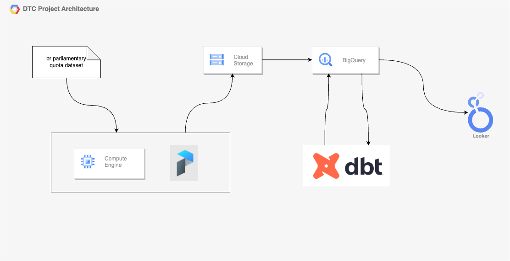

# DataTalks.Club final project

The project will cover following tools:
- Terraform
- Prefect
- Google BigQuery
- Google Cloud Storage
- DBT
- Google Compute Engine
- Docker

Dataset used can be found [here](https://www2.camara.leg.br/transparencia/cota-para-exercicio-da-atividade-parlamentar/dados-abertos-cota-parlamentar). Prefect official Dockerfile [here](https://github.com/PrefectHQ/prefect/blob/main/Dockerfile)

## Architecture overview:



# Reproducing:
In order to run prepare the environment for the pipelines that will be executed, you have to setup beforehand:   
1. Github environment variables - will be used when running Actions (CD pipeline)
2. ...

All prepared, now we can dive into pipelines settings.

## Prefect pipeline (collecting data)

After infrastructure creation (will run Terraform code triggered by GitHub Actions), we have to (1) setup Git SSH key, (2) clone this repo, (3) run `docker compose up -d --build`, (4) create a block to store GCP Credentials, (5) create a bucket named `terraform-tfstate-dtc-de-project` to store tf state file, (6) define your `.env` file and navigate to `prefect orion` container.

After that, you must create, deploy and trigger a `prefect deployment` using the 3 commands below:
- `first command`
- `second command`
- `third command`

Then, just start a new `prefect agent` to collect and effective run the flow:   
```
$ prefect agent start -q 'default'
``` 

Done, all the data is already in BigTable. Now we need to run the cleaning process.

## DBT pipeline (cleaning data)

We are using dbt cloud for the project. Said that, you must create your dbt cloud account, setup up a connection to BigQuery and configure github to sync this repo to dbt cloud. [Here](https://docs.getdbt.com/docs/cloud/connect-data-platform/connect-your-database#connecting-to-bigquery) are some instructions on this.

The dbt files are placed under `/dbt`. To build the tables with clean and aggregated data, you just need to run the following dbt command:

```
$ dbt build --full-refresh --select +cota_parlamentar_by_state_party_date
```
